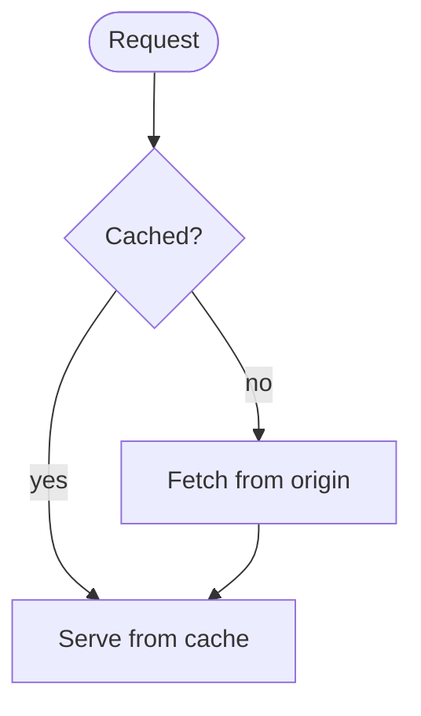

# Two diagrams

```mermaid
flowchart TD
    A([Request]) --> B{Cached?}
    B -- yes --> C[Serve from cache]
    B -- no --> D[Fetch from origin]
    D --> C
```

Some text between them.

~~~mermaid
flowchart LR
    Plan --> Build --> Measure --> Learn --> Plan
~~~
